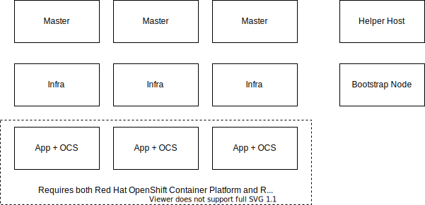
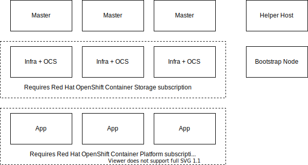
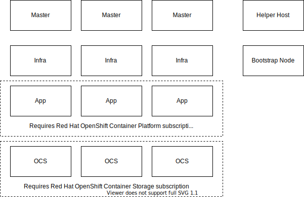

# Deployment Options

Node roles:

* Master = OpenShift control plane
* Infra = OpenShift router, logging, monitoring, and integrated image registry
* App = Application node
* OCS = Ceph control plane + data plane

## Simple Deployment

## Optimized Deployment

## Scaled-out Deployment

