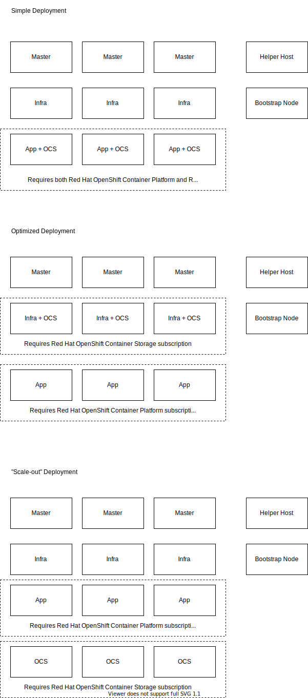

# Deployment Options

Master = OpenShift control plane

Infra = OpenShift router, logging, monitoring, and integrated image registry

App = Application node

OCS = Ceph control plane + data plane

# Node Sizing

